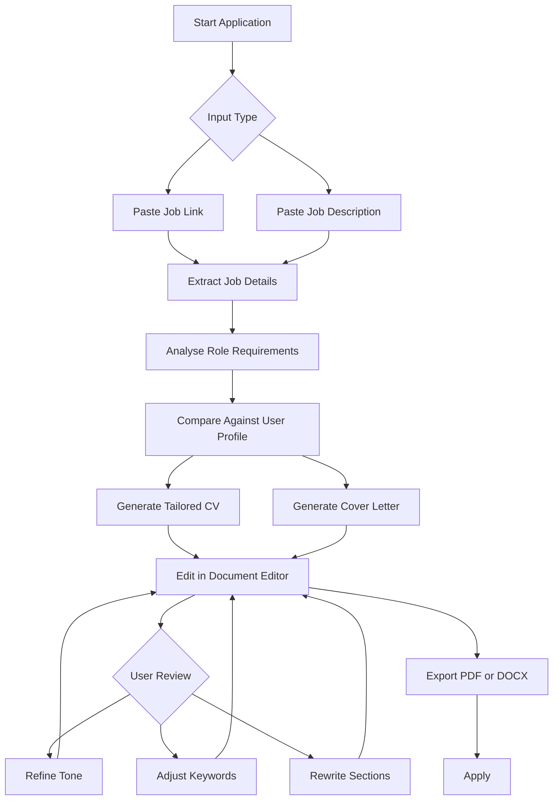
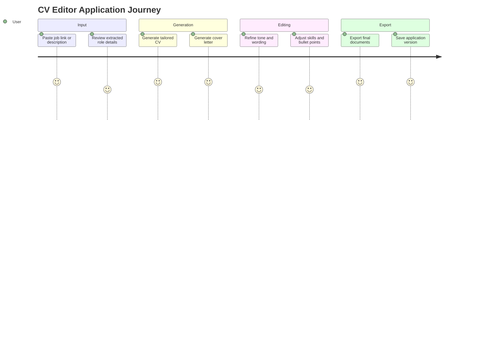
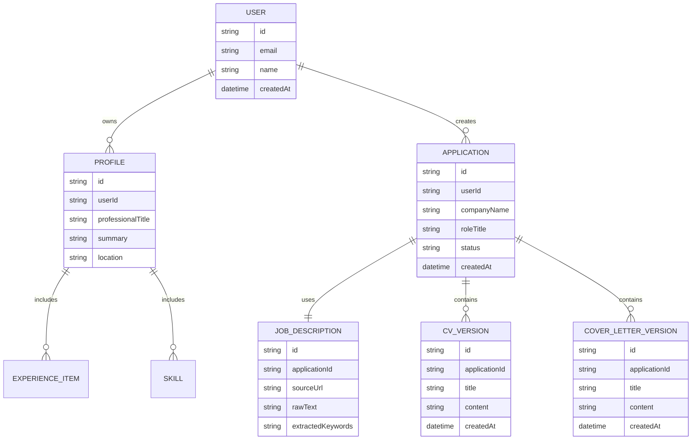
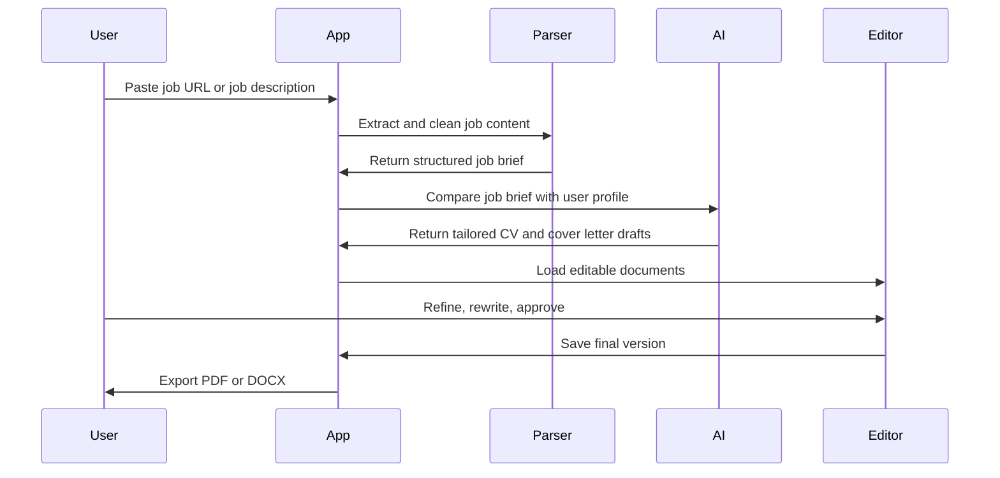

[README.md](https://github.com/user-attachments/files/27654893/README.md)
# CV Editor

> A smart CV and cover letter editor that helps users tailor applications from a job link or pasted job description.


## Overview

CV Editor is a web-based tool for creating tailored CVs and cover letters quickly, clearly, and professionally.

Users can paste a job description or submit a job post hyperlink. The app analyses the role requirements, compares them against the user's profile, and generates a tailored CV and cover letter that can be edited, refined, saved, and exported.

The goal is not to replace the user’s voice. The goal is to reduce repetitive application work while helping each application feel focused, relevant, and human.

## Core Problem

Applying for jobs is repetitive, stressful, and time-consuming.

Most candidates already have strong experience, but struggle to quickly reframe that experience for each role. Job descriptions vary in language, structure, seniority, and keyword expectations. This often leads to rushed applications, generic cover letters, and CVs that do not clearly match the job.

CV Editor solves this by turning a job description into a structured application brief, then helping the user generate polished, role-specific documents.

## Key Features

### 1. Generate from a job hyperlink

Paste a job post URL and CV Editor will attempt to extract the job title, company name, responsibilities, requirements, keywords, and application context.

Useful for:

- LinkedIn job posts
- Company career pages
- Job boards
- Recruiter listings
- Remote role listings

### 2. Generate from a pasted job description

Paste any job description directly into the editor when a hyperlink is unavailable, blocked, private, or poorly formatted.

The app should support messy, long-form job posts and turn them into a clean application brief.

### 3. Job analysis

The system analyses the job description and identifies:

- Role title
- Company or client name
- Seniority level
- Required skills
- Preferred skills
- Tools and technologies
- Industry context
- Keywords for ATS alignment
- Tone of the company or job post
- Main problems the role appears to solve

### 4. CV tailoring

The app creates a tailored CV by adapting the user’s existing profile, experience, skills, and project history to the target role.

It can suggest:

- A stronger professional summary
- Relevant skills to highlight
- Role-specific bullet points
- Better section ordering
- Keyword improvements
- Missing information the user may need to add
- Multiple versions for different job types

### 5. Cover letter generation

The app generates a focused cover letter based on the job description and the user’s experience.

The cover letter should be:

- Concise
- Human-sounding
- Role-specific
- Professional but warm
- Clear about why the user is a strong match
- Editable before export or submission

### 6. Interactive document editor

Users should be able to edit generated content directly inside the app before exporting.

Editor features may include:

- Inline editing
- Section reordering
- Tone adjustments
- Bullet point rewriting
- Save as draft
- Compare versions
- Undo and restore previous versions

### 7. Export options

Users can export final documents as:

- PDF
- DOCX
- Plain text
- Markdown
- Copy-ready email text

## Visual Product Flow



## Suggested User Journey



## Example Use Case

A user finds a Product Designer role on a company website.

They paste the job link into CV Editor. The app extracts the job title, requirements, company context, and key responsibilities. It identifies that the role focuses on design systems, SaaS dashboards, user research, and stakeholder collaboration.

The app then generates:

1. A tailored CV summary
2. Adjusted experience bullet points
3. A refined skills section
4. A concise cover letter
5. A list of missing details the user may want to add manually

The user edits the result, exports the CV and cover letter as PDFs, and saves the application version for later tracking.

## Recommended App Structure

```text
cv-editor/
├── app/
│   ├── dashboard/
│   ├── editor/
│   ├── jobs/
│   ├── profile/
│   └── exports/
├── components/
│   ├── editor/
│   ├── forms/
│   ├── layout/
│   └── ui/
├── lib/
│   ├── ai/
│   ├── extraction/
│   ├── parsing/
│   ├── scoring/
│   └── export/
├── data/
│   ├── templates/
│   └── sample-jobs/
├── public/
├── tests/
└── README.md
```

## Possible Tech Stack

This project can be built with different stacks. A modern web-based version could use:

| Area | Suggested Tooling |
|---|---|
| Frontend | Next.js, React, TypeScript |
| Styling | Tailwind CSS, shadcn/ui |
| Editor | TipTap, Lexical, or ProseMirror |
| AI Layer | OpenAI API or compatible LLM provider |
| Job Extraction | Browser parser, API fetcher, or manual paste fallback |
| Database | Supabase, PostgreSQL, Firebase, or SQLite |
| Authentication | Clerk, Supabase Auth, Auth.js |
| Export | React PDF, Puppeteer, DOCX library |
| Deployment | Vercel, Netlify, Railway, Render |

## Suggested Data Model



## AI Generation Principles

Generated content should follow these principles:

- Stay truthful to the user’s actual experience
- Never invent employers, degrees, metrics, tools, or responsibilities
- Clearly mark any assumptions or missing details
- Prioritise relevance over keyword stuffing
- Use natural, confident language
- Keep CV bullet points specific and outcome-led
- Keep cover letters concise and human
- Allow the user to review everything before export

## Suggested Prompt Flow



## MVP Scope

The first version should focus on the core application workflow.

### Must have

- User profile input
- Paste job description
- Paste job URL
- Job description analysis
- CV generation
- Cover letter generation
- Editable output
- PDF export
- Saved application drafts

### Should have

- DOCX export
- Version history
- Keyword match score
- Tone selector
- Application tracker
- Saved templates

### Could have

- LinkedIn profile import
- Portfolio link suggestions
- Email draft generator
- Recruiter message generator
- Interview prep questions
- Job fit scoring
- Multi-language support

## Product Screens

Suggested screens for the first version:

1. Dashboard
2. User Profile Builder
3. Job Input Screen
4. Job Analysis Summary
5. CV Editor
6. Cover Letter Editor
7. Export Preview
8. Application Tracker
9. Settings

## Visual Wireframe Sketch

```text
+------------------------------------------------------+
| CV Editor                                            |
| Tailor your CV and cover letter for any job.         |
+---------------------------+--------------------------+
| Paste Job Link            | Paste Job Description    |
| [https://...]             | [Long job text...]       |
| [Analyse Job]             | [Analyse Description]    |
+---------------------------+--------------------------+
| Job Match Summary                                    |
| Role: Senior Product Designer                        |
| Company: Example Studio                              |
| Keywords: SaaS, UX Research, Design Systems          |
+------------------------------------------------------+
| Generated Documents                                  |
| [Tailored CV] [Cover Letter] [Recruiter Email]       |
+------------------------------------------------------+
| Editor                                               |
| Summary                                              |
| Experience                                           |
| Skills                                               |
| Cover Letter                                         |
+------------------------------------------------------+
| [Save Draft] [Export PDF] [Export DOCX]              |
+------------------------------------------------------+
```

## Example Output Types

CV Editor should be able to generate several content types from one job description:

| Output | Purpose |
|---|---|
| Tailored CV | Main application document |
| Cover Letter | Direct company or recruiter submission |
| Recruiter Message | Short outreach note for LinkedIn or email |
| Application Summary | Quick record of what was tailored and why |
| Interview Prep | Likely questions based on the role |
| Skills Gap Notes | Missing skills or experience to address |

## Installation

```bash
git clone https://github.com/your-username/cv-editor.git
cd cv-editor
npm install
npm run dev
```

## Environment Variables

Create a `.env.local` file in the root directory.

```bash
NEXT_PUBLIC_APP_URL=http://localhost:3000
DATABASE_URL=your_database_url
OPENAI_API_KEY=your_openai_api_key
AUTH_SECRET=your_auth_secret
```

Update the variable names based on your chosen stack.

## Development Scripts

```bash
npm run dev       # Start local development server
npm run build     # Build production app
npm run start     # Start production server
npm run lint      # Run linting
npm run test      # Run tests
```

## Accessibility Considerations

The editor should be designed for clarity and low cognitive load.

Recommended accessibility requirements:

- Clear labels on every form field
- Keyboard-friendly editor controls
- Strong contrast for text and actions
- Large clickable buttons
- Readable document previews
- Helpful error states
- No hidden AI actions without user review

## Privacy and Safety

CVs contain sensitive personal information. The app should treat user data carefully.

Recommended safeguards:

- Encrypt stored user documents where possible
- Allow users to delete documents permanently
- Avoid training models on user data without explicit consent
- Show when content was AI-generated
- Require user approval before exporting or sending
- Do not fabricate job experience
- Keep a clear audit trail of generated versions

## Roadmap

### Phase 1: MVP

- Manual profile setup
- Job description paste
- Basic job URL extraction
- CV and cover letter generation
- Editable document editor
- PDF export

### Phase 2: Application Management

- Application tracker
- Version history
- Saved role templates
- Keyword match score
- Recruiter message generator

### Phase 3: Advanced Intelligence

- Portfolio matching
- Interview prep
- Skills gap analysis
- Company tone analysis
- Multi-CV profile library
- Smart recommendations per industry

### Phase 4: Collaboration

- Share preview links
- Mentor or recruiter feedback mode
- Comments on document sections
- Exportable review notes

## Success Metrics

Useful product metrics could include:

- Time saved per application
- Number of generated CVs exported
- Number of cover letters exported
- Percentage of drafts edited before export
- User satisfaction after each application
- Repeat usage per week
- Job interview conversion tracking, where voluntarily added by the user

## Future Enhancements

- Chrome extension for capturing job posts
- Browser bookmarklet
- Job board integrations
- ATS score preview
- Portfolio project recommendation engine
- Tone profiles for different industries
- One-click creation of a matching email body
- Custom templates for design, tech, education, marketing, operations, and executive roles

## License

This project is intended as an early-stage product concept. Add your preferred license before public release.

## Closing Note

CV Editor is designed to make job applications feel less repetitive and more strategic.

The best version of this product should help people communicate their value clearly, without forcing them to sound robotic, generic, or over-optimised.

